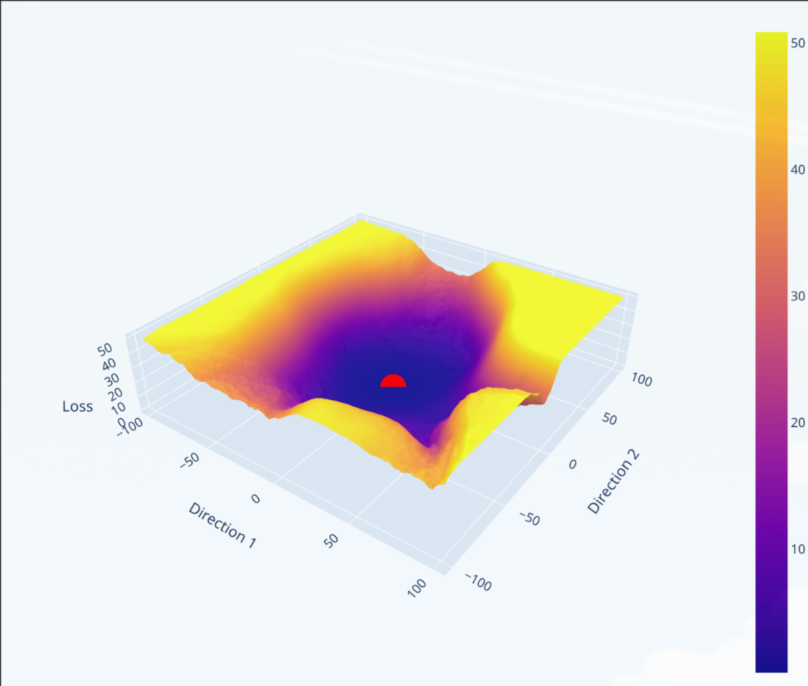
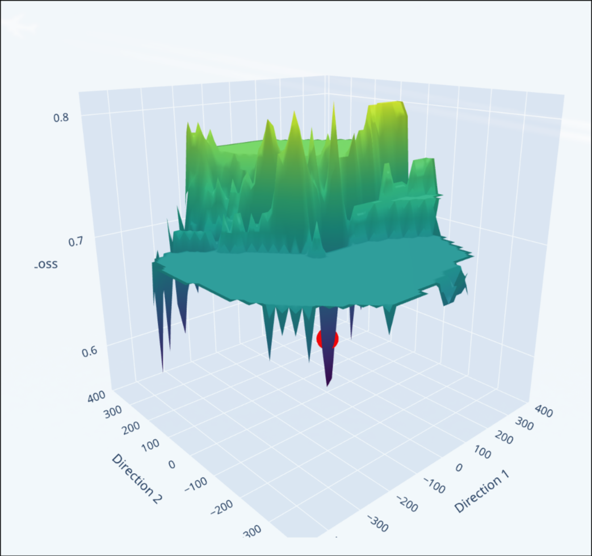

# Dog vs. Cat Image Classifier

This directory contains experiments on binary image classification using convolutional neural networks, trained on grayscale pet images. Beyond standard training and evaluation, the notebook explores the geometry of the loss landscape through random-direction perturbation analysis.

## Notebooks

* `dog_cat_classifier.ipynb`: End-to-end binary classification pipeline. It covers:
  * **Data Loading & Preprocessing**: Images are loaded in grayscale, center-cropped to square, resized to 64×64, normalized to [0, 1], and augmented with horizontal flips (×2 dataset size).
  * **Sobel Filter Exploration**: Manual application of Sobel kernels (via `scipy.signal.convolve2d`) as a preliminary inspection of edge-detection features before training.
  * **Custom CNN (`CNN`)**: A dual-branch architecture with frozen Sobel convolutions (horizontal and vertical) for fixed edge extraction, followed by learnable feature extraction layers and fully connected classification head.
  * **Compact CNN (`SmallCNN`)**: A standard sequential architecture with three Conv2d→ReLU→MaxPool blocks and a fully connected head, trained with SGD + weight decay and evaluated on held-out test data.
  * **Loss Landscape Visualization**: Exploration of the loss surface geometry by perturbing trained model parameters along two random normalized directions in weight space, computing BCE loss over a 100×100 grid, and rendering the result as an interactive 3D surface plot with Plotly.

## Loss landscapes visualization
Zoomed-in view of the loss landscape for the `SmallCNN` model:

Large scale view of the loss landscape for the `CNN` model:

## Data

Images are sourced from the [Dog and Cat Classification Dataset](https://www.kaggle.com/datasets/bhavikjikadara/dog-and-cat-classification-dataset) on Kaggle, downloaded via `kagglehub`. The dataset provides separate `Cat/` and `Dog/` directories of JPEG images of varying resolutions.