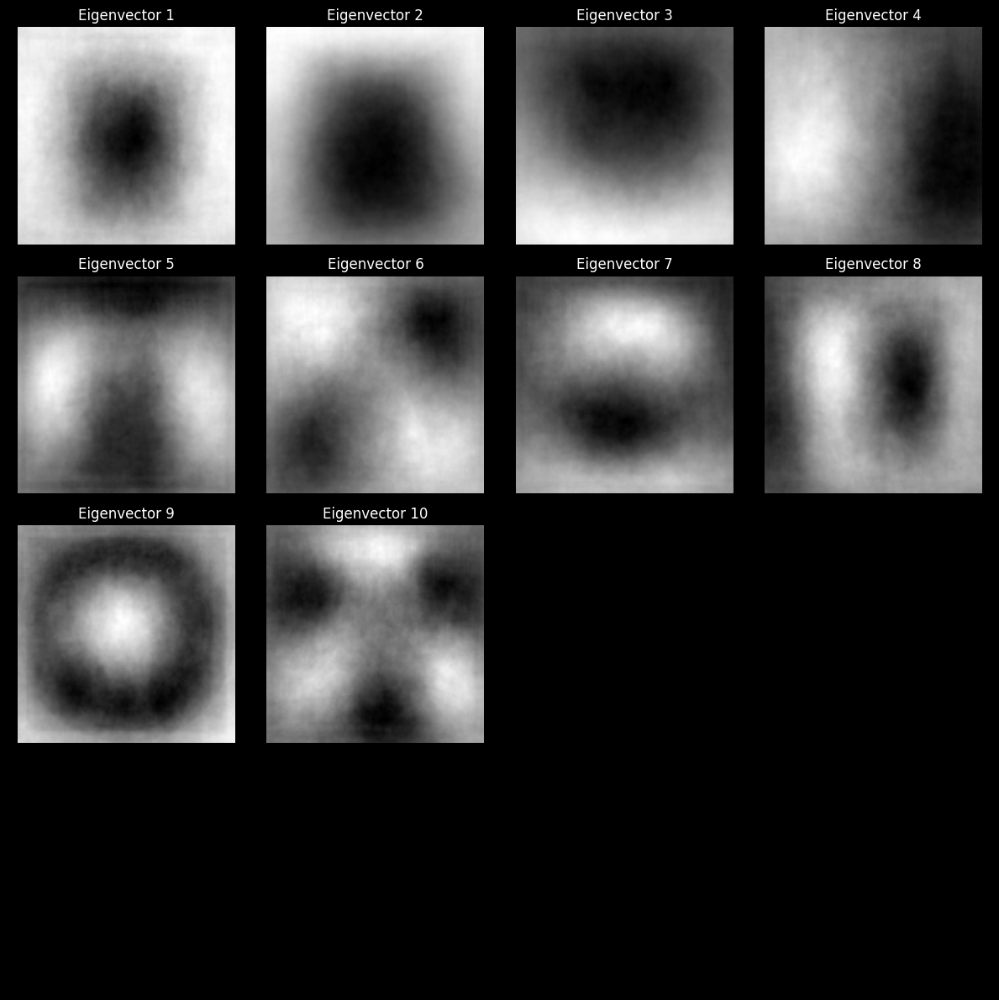
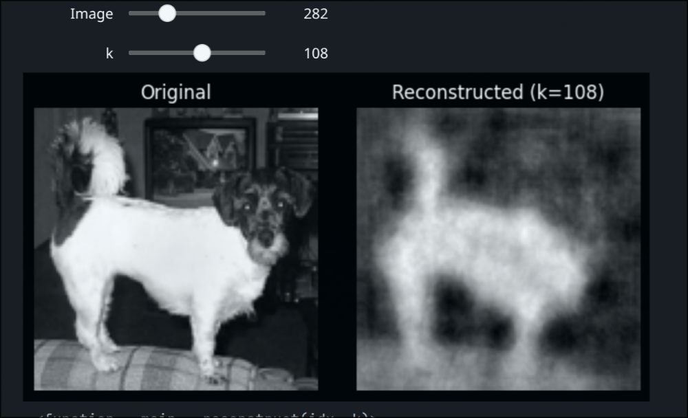

# Dog vs. Cat Classification via PCA

This directory contains a computational experiment exploring dimensionality reduction and linear classification on a large-scale image dataset, using the Dogs vs. Cats image corpus.

## Notebooks

- **`dog_cat_pca.ipynb`**: End-to-end pipeline for image-based binary classification. The experiment is structured as follows:
  - **Data Loading & Preprocessing**: Loads 1,000 images per class from Kaggle, converting them to grayscale and resizing to 128×128 before flattening into feature vectors.
  - **PCA via Gram Matrix**: Since the dimensionality *D* greatly exceeds the sample count *N*, the covariance matrix is approximated as X Xᵀ / N rather than Xᵀ X / N, making eigendecomposition tractable. The resulting eigenvectors are projected back to pixel space for visualization.
  - **Reconstruction Analysis**: Interactive widget to reconstruct images from *k* principal components, illustrating the trade-off between compression and fidelity.
  - **Logistic Regression Classifier**: A from-scratch SGD logistic regression is trained on the PCA-encoded features (*k* = 50), then benchmarked against scikit-learn's `LogisticRegression` with L2 regularization.

## Visualizations

**Top 10 PCA Eigenvectors** — the principal axes of variation in the dataset, visualized in pixel space:

**Image Reconstruction** — original image alongside its reconstruction from *k* principal components:

## Data

Image data is sourced from the [Dogs vs. Cats dataset](https://www.kaggle.com/datasets/bhavikjikadara/dog-and-cat-classification-dataset) on Kaggle, accessed via `kagglehub`. The pipeline uses the `PetImages/Dog` and `PetImages/Cat` subdirectories.

## Conclusions

The classifier achieves only ~60% test accuracy, barely above random chance for a binary task. The core issue lies in the assumption underlying PCA: that the meaningful variation in the data can be captured by a small number of linear directions. Pet images violate this assumption fundamentally — pose, lighting, breed, background, and scale all vary in highly non-linear ways that no compact linear basis can adequately encode.

This is reflected in the reconstruction analysis: even with a large number of components, reconstructed images remain blurry and structurally imprecise, indicating that the PCA subspace fails to capture the discriminative features that distinguish dogs from cats. The eigenvectors themselves (shown above) resemble global lighting and texture patterns rather than semantically meaningful features.

The experiment highlights a key limitation of linear methods on natural image data, and motivates the use of non-linear approaches — such as kernel PCA, or learned representations via convolutional neural networks — where the feature extraction is adapted to the geometry of the data manifold rather than imposed as a flat linear projection.