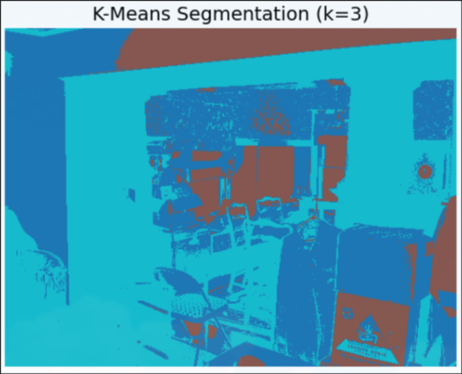
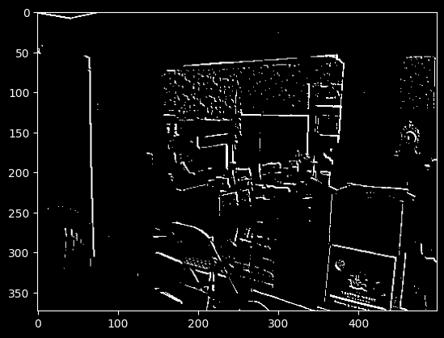
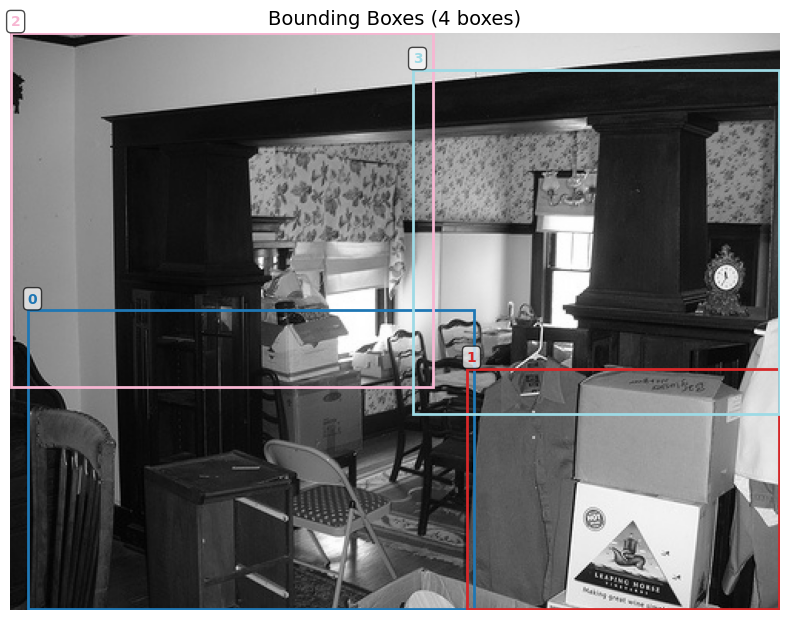
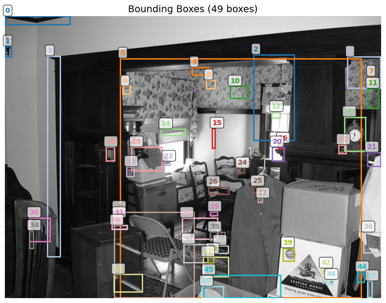
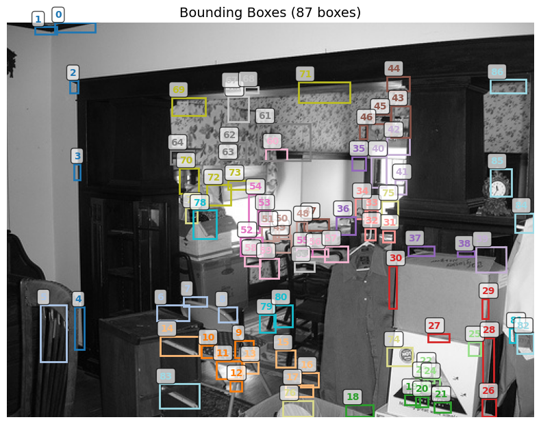
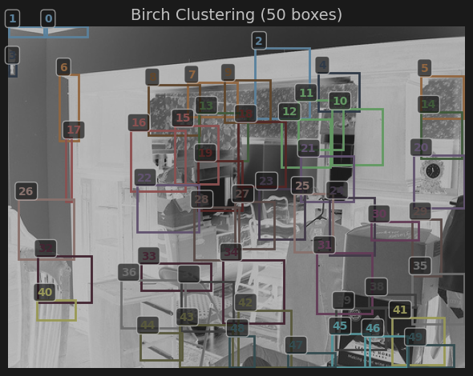

# Object Detection via Unsupervised Clustering

This directory explores a fully unsupervised approach to object detection on the
PASCAL VOC 2007 dataset. Rather than training a detector end-to-end, the pipeline
decomposes the problem into two independent stages: **edge-based feature extraction**
via Sobel convolution, followed by **spatial clustering** of the resulting edge
coordinates to produce bounding-box proposals. Several clustering algorithms are
benchmarked, and their hyperparameters are tuned through a concurrent grid search
scored by a pretrained CNN ensemble.

## Notebooks

* `object_detection_clustering.ipynb`: End-to-end unsupervised detection pipeline.
  This experiment is structured in four progressive stages:

  * **Baseline: Pixel-Level K-Means Segmentation.** As an initial sanity check,
    K-Means is applied directly to raw pixel intensity values to produce
    color-coded segmentation masks. This establishes a baseline and motivates the
    need for a more structured feature representation.

  

  * **Feature Extraction via Sobel Convolution.** A pair of horizontal and vertical
    Sobel kernels is applied to each grayscale image. The resulting gradient
    magnitudes are normalized, summed, and thresholded to yield a sparse binary
    feature map that highlights structural edges — the input to all subsequent
    clustering steps.

  

  * **Clustering Algorithms Comparison.** The $(row, col)$ coordinates of active
    edge pixels are fed into four different clustering algorithms, each of which
    produces a set of bounding-box proposals via convex hulls over cluster members:

    * **K-Means** — fixed number of clusters; fast but requires specifying $k$.

  

    * **DBSCAN** (`eps=7`, `min_samples=5`) — density-based; naturally handles
      noise and produces variable cluster counts, but sensitive to `eps`.

  

    * **OPTICS** (`min_samples=20`) — density-based like DBSCAN but eliminates
      the need to tune `eps` at the cost of higher computational overhead.

  

    * **Birch** (`threshold=20`) — hierarchical and memory-efficient; does not
      require specifying the number of clusters and scales well to dense edge maps.

  

  * **Concurrent Grid Search with CNN Scoring.** A hyperparameter sweep over
    Birch `threshold` and Sobel `fm_threshold` is performed across the dataset.
    Each parameter combination is scored by the mean classification confidence
    of the proposed regions, evaluated using a batched ensemble of two lightweight
    pretrained models (MobileNetV3-Small and SqueezeNet 1.1). The scoring function
    is `score = mean_confidence + λ · num_regions`, where `λ` controls a region-count
    penalty. CPU-heavy work (feature maps, Birch fitting) is parallelized across
    images with a `ThreadPoolExecutor`, while CNN forward passes are CUDA-accelerated
    and serialized via a semaphore to prevent GPU oversubscription.

  

## Data

The experiments use the [PASCAL VOC 2007](https://www.kaggle.com/datasets/zaraks/pascal-voc-2007)
dataset, downloaded via `kagglehub`. It provides JPEG images alongside XML
annotation files in VOC format, which are parsed to extract ground-truth
bounding boxes and object category labels. Images are loaded in grayscale for
all clustering stages.