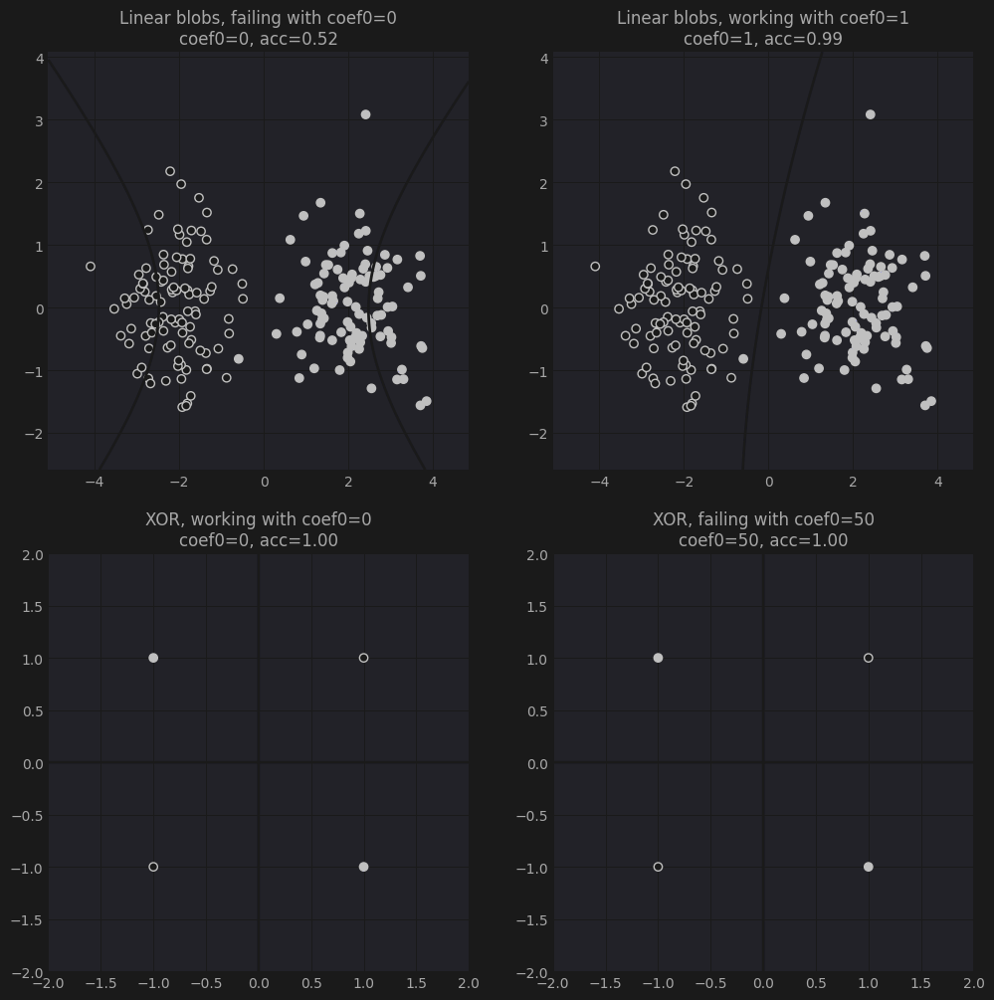

# XOR Classification with Polynomial SVM

This experiment examines the role of the `coef0` hyperparameter in polynomial
kernel SVMs, using the XOR problem as a minimal testbed. The XOR dataset is
linearly non-separable by construction, making it a clean benchmark for
evaluating how kernel geometry affects the learned decision boundary.

## Notebooks

* `XOR_svm.ipynb`: Fitting polynomial SVMs on two contrasting datasets — linearly
  separable Gaussian blobs and the canonical 4-point XOR pattern — across a grid
  of `coef0` values. The key finding is that `coef0` controls the relative weight
  of lower-degree terms in the kernel expansion `(γ·xᵀz + coef0)^d`, which
  determines whether the SVM can express the cross-shaped decision boundary
  required by XOR. A 2×2 panel plots all four combinations, illustrating that
  the parameter value which solves one problem can break the other.

## Data

Both datasets are synthetically generated: the linear case uses `sklearn`'s
`make_blobs` with two Gaussian clusters, and the XOR case uses the four canonical
corner points of the unit square with alternating class labels.

---

